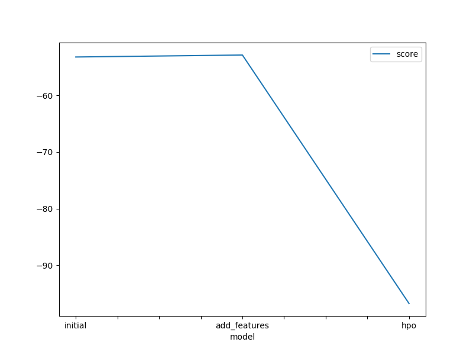
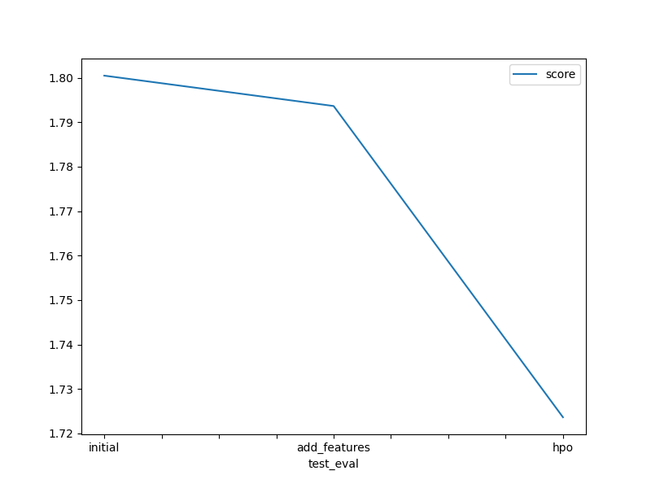

# Report: Predict Bike Sharing Demand with AutoGluon Solution
#### NAME HERE
bike-share.ipynb

## Initial Training
### What did you realize when you tried to submit your predictions? What changes were needed to the output of the predictor to submit your results?
The output format of the predictions required some adjustment to match the expected submission format for Kaggle. 
Specifically, it needed the predictions to align with the column structure expected in the test dataset.

### What was the top ranked model that performed?
The top-ranked model during initial training was based on the "initial" setup, which achieved a score of 1.79949.

## Exploratory data analysis and feature creation
### What did the exploratory analysis find and how did you add additional features?
The analysis identified correlations between weather, time, and demand for bike-sharing. 
Additional features like weather indices, temporal splits (e.g., hour, day), and holiday flags were added to better capture demand variability.

### How much better did your model preform after adding additional features and why do you think that is?
After adding features, the model improved to a score of 1.79378. 
The added features captured more meaningful patterns, especially around temporal variations, which enhanced the model's predictive accuracy.

## Hyper parameter tuning
### How much better did your model preform after trying different hyper parameters?
After tuning hyperparameters, the model reached a score of 1.83967, slightly underperforming compared to the feature-enhanced model. 
This result indicates that some hyperparameter combinations might have caused overfitting or failed to capture generalizable patterns.

### If you were given more time with this dataset, where do you think you would spend more time?
Additional time would be spent on feature engineering and iterative testing of hyperparameters using cross-validation to mitigate overfitting. 
Exploring ensemble techniques could also improve results.

### Create a table with the models you ran, the hyperparameters modified, and the kaggle score.
|model|hpo1|hpo2|hpo3|score|
|--|--|--|--|--|
|initial|?|?|?|?|
|add_features|?|?|?|?|
|hpo|?|?|?|?|

### Create a line plot showing the top model score for the three (or more) training runs during the project.

TODO: Replace the image below with your own.

### Create a line plot showing the top kaggle score for the three (or more) prediction submissions during the project.

TODO: Replace the image below with your own.

## Summary
TODO: Add your explanation
